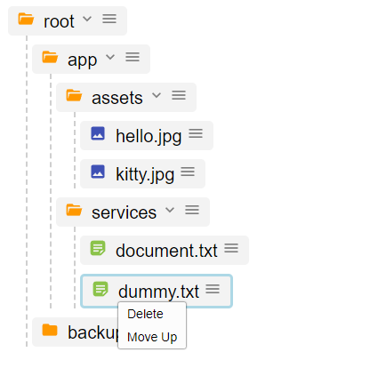
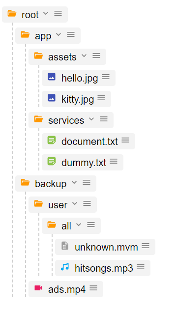
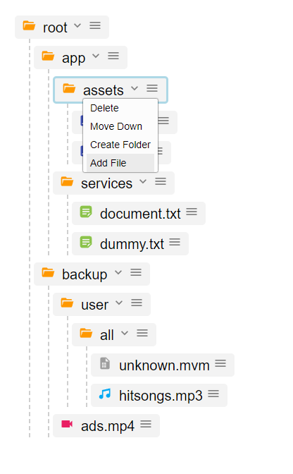
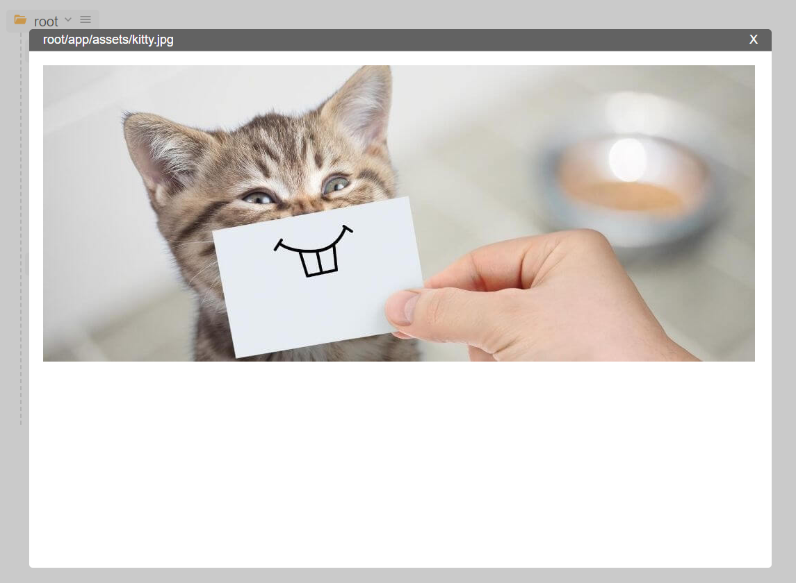

# Code Challenge: React TreeView

This project was bootstrapped with [Create React App](https://github.com/facebook/create-react-app).

## How to run

In the project directory, you can run:

### `yarn start`

Runs the app in the development mode.\
Open [http://localhost:3000](http://localhost:3000) to view it in the browser.

You will also see any lint errors in the console.

### `yarn test`

Launches the test runner in the interactive watch mode.\

# Screenshots
| Screen 1 |      Screen 2      |  Screen 3 |
|----------|:-------------:|------:|
|  |   |  |

ContextView

